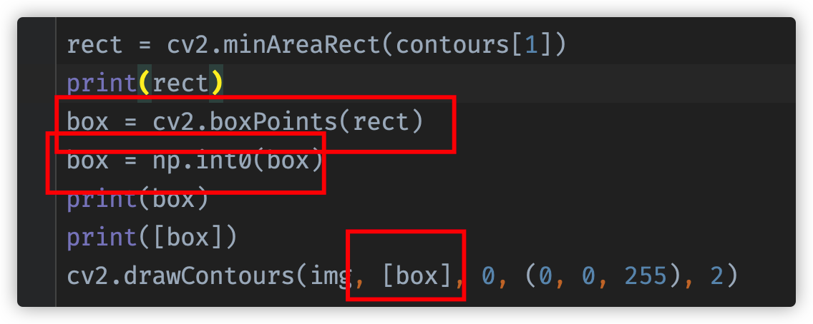

- [ ] B 站课程

- [ ] CSDN 课程

- [ ] C++重写

# 创建和显示窗口

- namedWindow() 给窗口打编号
- imshow()
- destroyAllWindows()
- resizeWindow 默认窗口大小和图片大小一样

# 读取和保存图像

- imread() 读取图像
- imwrite() 保存图像

# 读取和保存视频

- VideoCapture() 读取视频
- VideoWriter() 保存视频
- cap.read() 读取视频帧 返回两个值 一个是状态一个是帧
- cap.isOpened() 检查是否成功打开
- cap.get() 获取视频属性
- cap.set() 设置视频属性
- cap.release() 释放视频

# 鼠标控制

- setMouseCallback(winname,callback,us erdata)
- callback(event,x,y,flags,userdata)

# TrackBar

- createTrackbar(trackbarName,winname,value,count,callback) value 当前值 count 最大值 callback 回调函数
- callback(value)
- getTrackbarPos(trackbarName,winname)

不知道是什么问题 窗口会闪退

# 色彩空间

HSV(HSB)
Hue: 色相，色彩，红色，蓝色
Saturation: 饱和度，纯度，鲜艳程度
Value: 亮度，明度，明亮程度 Brightness

YUV 常用作视频中
YUV 4:2:0
YUV 4:2:2
YUV 4:4:4

# Numpy

- 创建数组 array()
- 创建全零 zeros() / ones
- 全值数组 full()
- 创建单元数组 identity() / eye()

- 索引 [y,x]
- [y,x,channel] 通道索引 可以认为 [y,x,z]

# Mat

# 图像融合

addWeighted(A,alpha,B,beta,gamma)
aplha A 的权重
beta B 的权重
gamma 静态权重

# 图像翻转

flip(img,flipCode)
flipCode == 0 上下
flipCode > 0 左右
flipCode < 0 上下加左右

# 图像旋转

rotate(img,rotateCode)

ROTATE_90_CLOCKWISE
ROTATE_180
ROTATE_90_COUNTERCLOCKWISE

# 仿射变换

仿射变换是 图像旋转，缩放，平移的总称
warpAffine(src,M,dsize,flags,mode,value)

src 输入图像
M 变换矩阵
dsize 输出图像大小
flags 插值方法
mode 边界填充模式
value 边界填充值

变换矩阵
getRotationMatrix2D(center,angle,scale)
center 旋转中心
angle 旋转角度 逆时针
scale 缩放比例

# 低通滤波

> 主要做图像模糊处理
> 降噪

均值
高斯
中值
双边

# 高通滤波

> 主要做图像锐化处理
> 增强边缘
> 增强对比度
> 增强细节
> 增强纹理

Sobel 索贝尔
Scharr 沙尔 3x3 索贝尔的size是-1 自动使用沙尔
Laplacian 拉普拉斯 不带降噪

# 滤波API

方盒滤波 boxFilter(src,ddepth,ksize,anchor,normalize,borderType)
src 输入图像
ddepth 输出图像深度
ksize 滤波器大小
anchor 锚点
normalize 是否归一化 若为True 就是均值滤波
borderType 边界填充模式、

均值滤波 blur(src,ksize,anchor,borderType)
src 输入图像
ksize 滤波器大小
anchor 锚点
borderType 边界填充模式

当方盒滤波当 normalize 为 True 时，就是均值滤波

# 高斯滤波

GaussianBlur(src,ksize,sigmaX,sigmaY,borderType)
src 输入图像
ksize 滤波器大小
sigmaX X 方向的标准差 钟形的延展长度 x
sigmaY Y 方向的标准差 钟形的延展长度 y
borderType 边界填充模式

# Sobel API

Sobel(src,ddepth,dx,dy,ksize,scale,borderType)
src 输入图像
ddepth 输出图像深度
dx X 方向导数
dy Y 方向导数
ksize 滤波器大小 默认3 设为-1的时候使用3x3的Scharr 滤波器

# 加法：

使用cv2.add()将两个图像相加，可以使用numpy中的矩阵加法来实现。但是在opencv中加法是饱和操作，也就是有上限值，numpy会对结果取模。

# 图像上的加法

大致有两种:
cv2.add():这是一个饱和操作
+:  这是Numpy中的运算，之一种模操作，res = img1 + img2
注意两幅图片的大小类型必须一致，或者第二个图象是一个标量
由于两者的差别，我们一般多用cv2.add(src1, src2)

# 拉普拉斯算子

> 可以同时求两个方向的边缘
> 对噪音敏感，一般需要先进行去燥在调用拉普拉斯

Laplacian(src,ddepth,ksize,scale,borderType)

# Canny 边缘检测

1. 使用5x5高斯滤波消除噪音
2. 计算图像梯度的方向 0 45 90 135
3. 取局部极大值
4. 阈值计算

Canney(img,minVal,maxVal)

# 形态学
一般用黑白图片处理
https://zhuanlan.zhihu.com/p/110330329

# 二值化
全局二值化
threshold(img,thresh,maxValue,type)
img 输入图像
thresh 阈值
maxValue 最大值 超过最大值换成maxValue 假设为200 阈值100 超过100的都换成200
type 阈值类型如图

# 自适应阈值

由于光照不均匀以及阴影的存在

只有一个阈值会使得在阴影处的白色被二值化成黑色

adaptiveThreshold API 
adaptiveThreshold(img,maxValue,adaptiveMethod,thresholdType,blockSize,C)

# 腐蚀

erode(img,kernel,iterations = 1)

iterations 是腐蚀次数

# 开运算

先腐蚀 在膨胀
可以去毛刺

# 闭运算

先膨胀 再腐蚀
去除内部的毛刺

# 形态学梯度

原图-腐蚀

# 高帽运算 顶帽运算

原图-开运算 可以留下毛刺或者噪点

# 黑帽运算

原图-闭运算 可以留下内部的毛刺和噪点

# 图像轮廓

具有相同颜色或者强度的连续点的曲线

1. 可以用于图形分析
2. 物体的识别与检测

为了检测的准确性，需要先对图像进行二值化或者Canny操作

findContours(img,mode,ApproximationMode)

返回值有两个 contours 轮廓列表 hierarchy 层级

## mode

https://www.cnblogs.com/wojianxin/p/12602490.html

RETR_EXTERNAL=0 表示只检测外轮廓 计算量较少

RETR_LIST=1 轮廓不建立等级关系

RETR_CCOMP=2 每层最多两级

RETR_TREE=3 按树形存储轮廓

 

ApproximationMode

CHAIN_APPROX_NONE 保存所有轮廓上的点

CHAIN_APPROX_SIMPLE 只保存角点

# 多边形逼近 凸包

approxPolyDP(curve,epslion,closed)
curve 输入的轮廓
epslion 轮廓的精度
closed 是否闭合

convexHull(points,clockwise)
points 输入的点
clockwise 是否顺时针

# 外接矩阵

## 最小外接矩阵

minAreaRect(points)   最小Rect

points 轮廓

可以得到任意多边形的最小外接矩阵 得到的类型是 rotatedRect

最小外接矩阵的中心 宽高 旋转角度

无法直接绘制

通过BoxPoints得到四个顶点的坐标 看下图

然后转为int型

drawContours好像是要传入一个三维 顶点集

但是以上的得到的是二维 再加一个括号变三维传入drawContours

然后使用drawContours可以画出来

boundingRect(array)    边界Rect

Array 轮廓

返回值 Rect 宽 高